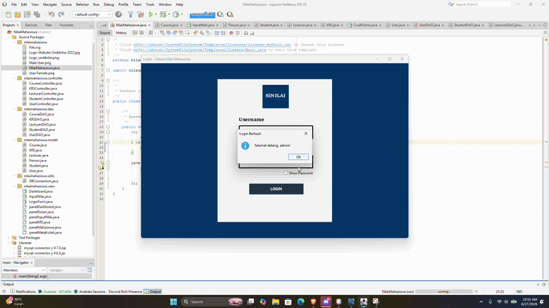
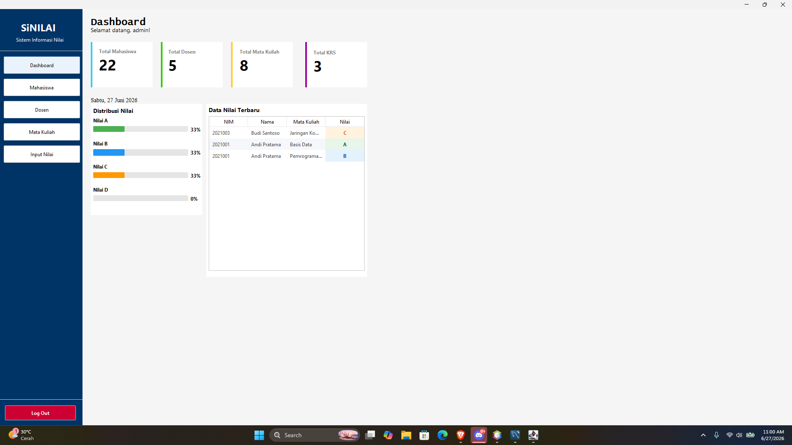
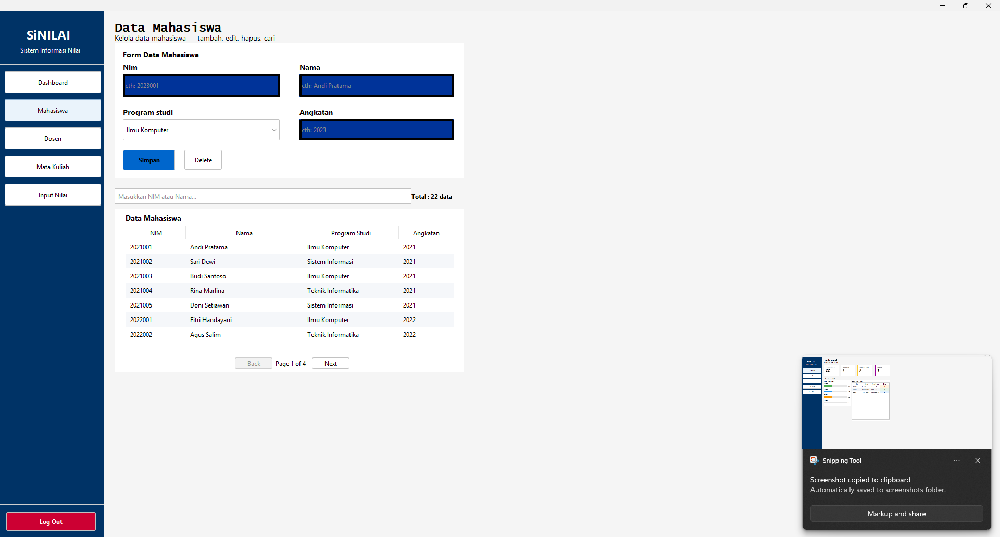
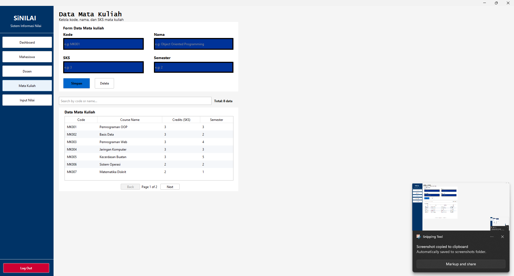
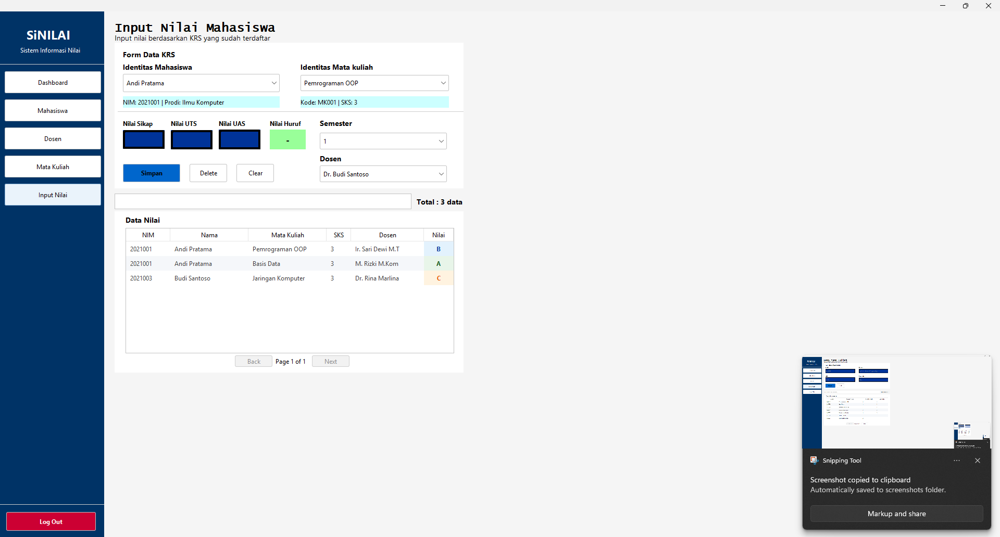
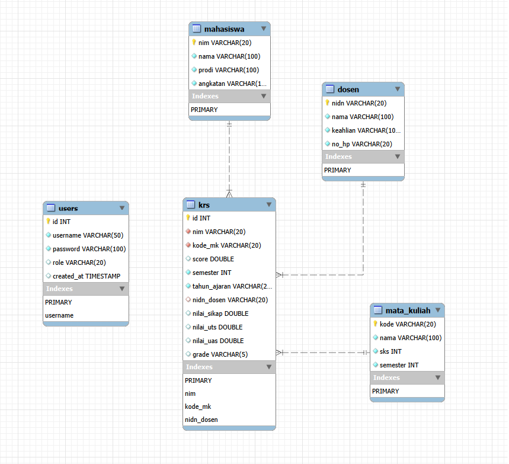

# SiNILAI - Sistem Informasi Nilai Mahasiswa

Aplikasi desktop berbasis Java (Swing) untuk mempermudah pengelolaan data akademik. Dibuat dengan antarmuka yang modern, bersih, dan rapi menggunakan tema FlatLaf.

---

## Demo Aplikasi
Preview singkat bagaimana aplikasi ini berjalan saat digunakan. 

Link Video : 

---

## Tampilan Antarmuka (Screenshots)

Berikut adalah beberapa halaman utama yang ada di dalam aplikasi SiNILAI:

### 1. Halaman Login

### 2. Halaman Dashboard

### 3. Kelola Data Mahasiswa

### 4. Kelola Data Dosen & Mata Kuliah

### 5. Form Input Nilai

---

## Teknologi yang Dipakai
* **Bahasa:** Java
* **IDE:** Apache NetBeans
* **Database:** MySQL
* **UI/Tema:** FlatLaf

## Cara Menjalankan Project
1. Buat database baru di MySQL/phpMyAdmin dengan nama `db_sinilai`.
2. Import file database `.sql` yang ada di folder project ini.
3. Buka project menggunakan NetBeans.
4. Pastikan library `mysql-connector-j` dan `flatlaf` sudah ditambahkan ke dalam *Libraries* project.
5. Jalankan file utama (Main Class) projectnya.

---

## Database MySQL ( Relation )
### Preview :

